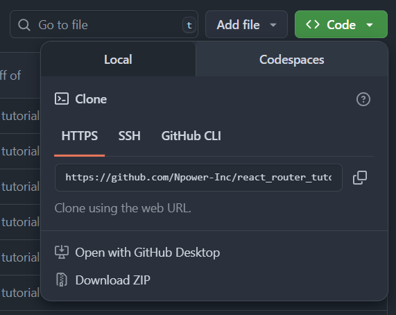

# NPower React Router Tutorial Starter Code
This is the starter code for the React Router Lesson as part of NPower's Path2Tech application development program.

## Prerequisites
You must have the following below installed to complete this lesson
- Node.js and NPM installed
- An environment to run JavaScript
    - Having Node.js installed on your system
    - You can run JavaScript with Visual Studio Code if you have the Node.js extension installed

## Checking Prerequisites
To check if you have Node and NPM installed, open a terminal and run
```
node --version
```
```
npm --version
```
If you get an error then you will need to go [Download Node](https://nodejs.org/en/download) to download Node.js for your operating system

## Installing Project
1. Please make sure to fork this repository to your personal GitHub. You will find the button to fork this repository near the top right part of the screen


Press this button and on the next screen it will give you the option to fork the repository make sure to click the green button title "Create fork" to fork the repositoy to your own GitHub

2. Clone the repository to your machine, to do this open a new terminal and run
```
https://github.com/<github_repo_owner>/<github_repo_name>.git
```
To get the GitHub URL to clone the repo click on the green button title "<> Code" this will open a dropdown and you can copy the URL to clone this git repository to your system.




## Getting Started
1. You will have to install your node packages from `package.json` to `node_modules`

To accomplish this, open this project in Visual Studio Code, and open a new terminal session

Run the command
```
npm install
```

2. To run the code you have two options, to run it with Visual Studio Code's GUI or to open a terminal and run the following command
```
npm run dev
```
Running this command will start your application on http://localhost:5173, if you do not see any errors you should be able to edit the source code and make changes!